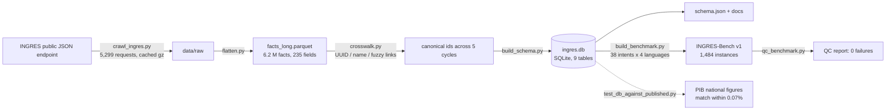
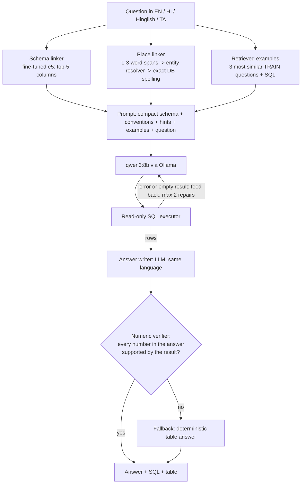

# INGRES-Text2SQL: Complete Project Overview

_Snapshot as of **2026-10-09**. Every number in this document is read from a file under `experiments/`, `reports/` or
`docs/` in this repository, and the source is named next to it. Anything not yet measured is marked
**TODO — requires experiment**. Repository: https://github.com/WAkshat/NLP-INGRES_

---

## 0. At a glance

| | |
|---|---|
| **What** | A natural-language interface that turns questions in **English, Hindi, Hinglish and Tamil** into SQL over India's official groundwater database (INGRES), runs the SQL safely and answers with numbers that are checked against the result |
| **Data** | Real CGWB/INGRES assessments: 5 cycles (GWRA 2020, 2022–2025), 37 states/UTs, 770 districts, 8,751 assessment units, 34,565 unit-year rows. National totals reproduce the published government figures to within **0.07%** |
| **Benchmark built** | **INGRES-Bench v1**: 371 questions × 4 languages = **1,484** question→SQL→answer instances, 4 difficulty levels, leakage-controlled splits, 0 QC failures |
| **Main metric** | Execution accuracy (**EX**): does the predicted SQL return the same result as the gold SQL? |
| **Best learned component** | Schema linker: column recall@3 **0.409 → 0.896** (Tamil 0.276 → 0.846); still 0.851 on question types never seen in training |
| **Best end-to-end result so far** | qwen3:8b + schema-linker hints: **23.2% EX** on test, against 18.0% without hints (+5.2 points, p = 0.008) |
| **Strongest baseline** | Keyword/template retrieval: 32.6% EX on test (38.8% on all eval splits). Not beaten yet |
| **Status** | Phases 1–8 done. Phase 9 (full pipeline) built and smoke-tested but **not yet evaluated**. Phase 10 (UI) built. Phase 11 (final evaluation and docs) open |
| **Tests** | 61 automated tests, all passing (`python -m pytest`) |

---

## 1. The problem

### 1.1 Context
India assesses its groundwater every cycle under the **GEC-2015 methodology** (Central Ground Water Board + states).
Results are published through **INGRES** (https://ingres.iith.ac.in, CGWB + IIT Hyderabad). For each assessment unit
(block / mandal / taluk / firka, about 7,000 per cycle), INGRES reports:
- annual recharge,
- extractable resource,
- extraction for irrigation, domestic and industrial use,
- stage of extraction (%),
- a category: **Safe / Semi-Critical / Critical / Over-Exploited** (plus Saline, Hilly Area).

### 1.2 Why this is hard to use today
- The portal is a **map-based, English-only, click-through** interface. There is no public download (Excel export is
  admin-only) and no documented API.
- The people who need the data most write in **Hindi, Hinglish (romanised, code-mixed Hindi-English) or regional languages
  such as Tamil**: farmers, district officials, journalists and researchers. Example: *"Ludhiana ke kitne blocks
  over-exploited hain?"*
- Simple questions ("Which Punjab blocks went from Critical to Over-Exploited between 2022 and 2025?") need several
  page visits and manual cross-referencing.

### 1.3 Why it is hard for NLP
1. **Multilingual and code-mixed input in three scripts** (Latin, Devanagari, Tamil), while the schema is English. A
   Tamil question shares no tokens with column names like `stage_of_extraction_pct`.
2. **Place names.** There are 8,751 units, and **169 unit names are shared across different states** (`ramnagar` ×10).
   INGRES spellings are idiosyncratic (`TAMILNADU`, Himachal district codes `KNG`, `SRM`). Users write names in
   other scripts and with typos.
3. **Domain conventions.** "The 2025 assessment" means `assessment_year = '2024-2025'`. Volumes are in hectare-metres
   (1 BCM = 10⁵ ham). Official national figures count fresh water only (total − saline).
4. **Cross-year comparability.** INGRES re-issues unit IDs between cycles, and several states changed unit granularity
   (Tamil Nadu firka → taluk, J&K district → block). A naive cross-year join is wrong.
5. **Trust.** A numeric answer that is fluent but wrong is worse than no answer. Numbers must be traceable to the data.

### 1.4 Research question
> How well can a natural-language interface translate Indian multilingual and code-mixed questions into correct,
> executable SQL over the INGRES schema, and **which components measurably improve execution accuracy**? The candidate
> components are schema linking, geographic entity resolution, tokenizer adaptation, numeric grounding and agentic repair.

---

## 2. Tech stack

| Layer | Technology | Used for |
|---|---|---|
| Language | Python 3.12.10 | everything |
| Data access | `urllib` HTTPS POSTs to the undocumented INGRES JSON endpoint (found by reading the portal's JS bundle) | crawl 5,299 responses, 0 failures |
| Data processing | pandas 2.3.3, numpy 1.26.4, pyarrow 25.0.1 (Parquet) | flatten 6.2 M raw facts, audit, reconciliation |
| Database | **SQLite** (21.8 MB) behind a **read-only executor**: SQLite authorizer allow-list, `mode=ro`, timeout, row cap | all SQL execution; blocks writes and injection (13 dedicated tests) |
| Classical ML / IR | scikit-learn 1.9.1 (TF-IDF, logistic regression, Naive Bayes), BM25 (own implementation) | keyword baseline, entity-resolver ranker, language tagger |
| Neural encoders | **sentence-transformers 3.1.0**, transformers 4.57.6, torch 2.14.0 (CPU) | `intfloat/multilingual-e5-small` (118 M params), fine-tuned contrastively for schema linking; mention/alias embeddings |
| LLM | **Ollama 0.35.1** serving **qwen3:8b** (Q4, local GPU, temperature 0, thinking off); Gemini API client also implemented | Text-to-SQL, translation, answer writing |
| Indic text | indic_transliteration 2.3.69 | romanising Devanagari/Tamil names, transliteration checks |
| Tokenizers compared | XLM-R (e5), Qwen3, mBERT, **MuRIL**, GPT-4o o200k | Phase 7 fertility study |
| Statistics / plots | scipy 1.17.1 (Spearman, McNemar), bootstrap CIs (own), matplotlib 3.11.2 | all reported intervals and figures |
| UI | **Streamlit 1.38** | Phase 10 demo app |
| Testing | pytest 9.1.1 | 61 tests: data vs published figures, SQL safety, benchmark QC, metrics, verifier, pipeline loop |
| Reports | python-docx, python-pptx | mid-term synopsis report and slides (`reports/midterm/`) |
| Hardware | NVIDIA **RTX 5060 8 GB** (runs the LLM), AMD Ryzen 7 9700X + 31 GB RAM (training, embeddings), Windows 11 | details in §3 |
| Versioning | git + GitHub; one commit per phase | |

**Why a local 8B model rather than a frontier API:** the Gemini free tier allowed **20 requests/day** (logged in
`experiments/baselines/gemini_quota_log.jsonl`), while one evaluation pass needs 872 requests. A local model is free,
reproducible (fixed seed, cached responses) and private. Its lower raw ability is a known limitation (§3, §10).

---

## 3. Hardware, models and compute

### 3.1 The machine
| Component | Spec | What it did in this project |
|---|---|---|
| **GPU** | **NVIDIA GeForce RTX 5060, 8 GB VRAM** (Blackwell generation), driver 617.14 | Ran the **LLM (qwen3:8b)** through Ollama. `ollama ps` shows the model **100% on GPU**, using 6.2 GB VRAM with our 8,192-token context. GPU utilisation ~98% during runs |
| CPU | AMD Ryzen 7 9700X (8 cores / 16 threads) | All model **training** (schema linker, vocabulary adaptation, entity-resolver ranker), embedding computation, data processing, evaluation |
| RAM | 31 GB | holds the database, gazetteer, encoders |
| OS / tools | Windows 11 Pro, Python 3.12, Ollama 0.35.1 | |

### 3.2 What ran where, and how long it took
To be precise about the GPU: the RTX 5060 did all the **LLM inference**. The **training** of our own models ran on the
**CPU**. The installed PyTorch is the CPU build (`torch 2.14.0+cpu`). The RTX 5060 is a Blackwell card (compute capability
sm_120) and needs a CUDA 12.8+ PyTorch build, which is not installed. Our trainable models are small (118 M parameters), so
each training took about 6 minutes on the CPU. The GPU-heavy part of the project is the ~3,700 LLM calls.

| Job | Model | Hardware | Time / volume |
|---|---|---|---|
| Crawl INGRES (Phase 1) | — | network | ~80 min, 5,299 requests, 0 failures |
| Fine-tune schema linker (Phase 5) | multilingual-e5-small | CPU | **386 s**: 712 pairs × (1 positive + 3 hard negatives), 3 epochs, 135 steps, batch 16, lr 2e-5, final loss 1.85 |
| Leave-intents-out retraining (Phase 5) | same | CPU | 3 extra trainings (seeds 0–2) |
| Vocabulary-adapted linker (Phase 7) | same + 78 new tokens | CPU | **359 s** |
| Entity-resolver ranker (Phase 6) | logistic regression over 12 features + e5 embeddings of 9,558 entities | CPU | **~6–7 min** including evaluation (364–406 s per run) |
| **All LLM experiments** (Phases 4, 7, 8, smoke tests) | **qwen3:8b** via Ollama | **RTX 5060** | **3,674 LLM calls, ≈2.1 GPU-hours** of generation; 5.18 M prompt tokens + 0.42 M output tokens; ≈2.5 s per SQL question, ≈2.4 s per answer sentence |
| Phase 9 evaluation (pending) | qwen3:8b | RTX 5060 | ≈1.5 h estimated |

### 3.3 The models
| | **qwen3:8b** (the LLM) | **multilingual-e5-small** (the encoder we fine-tune) |
|---|---|---|
| Role | writes SQL, translates (Phase 7), writes answer sentences | schema linking (ranks columns), retrieving similar train questions, mention/alias similarity in the resolver |
| Size | 8.2 B parameters, **4-bit quantised (Q4_K_M)**, 5.2 GB file | 118 M parameters, 12 layers, 384-dim vectors |
| Context / vocab | native 40,960 tokens; we use 8,192 so it fits in 8 GB VRAM | 512 tokens; XLM-R tokenizer, 250 k tokens, 100+ languages |
| Settings | temperature 0, seed 0, "thinking" mode off, responses cached on disk | query/passage prefixes, normalised embeddings, cosine similarity |
| Licence | Apache-2.0 | MIT |
| Why chosen | best of two local candidates on a 24-question dev pilot: qwen3:8b 8/24 vs qwen2.5-coder:7b 3/24; fits 8 GB VRAM | multilingual and small enough to fine-tune on a CPU in minutes |
| Trained by us? | **No.** Used as-is, prompted | **Yes.** Contrastive fine-tuning (Phase 5) |

### 3.4 Pros and cons of this setup (local GPU LLM + CPU training)
**Pros**
- **Zero cost per query and no quota.** ~3,700 calls cost nothing. The Gemini free tier allowed 20 per day.
- **Reproducible.** A fixed model file, temperature 0, a fixed seed and an on-disk cache give identical numbers on every
  re-run. API models can change silently.
- **Private and offline.** Nothing leaves the machine, and the demo works without internet. A government office could
  run it on one consumer GPU.
- **Fast enough to be interactive:** ~2.5 s per question, ~5 s for the full pipeline including the answer sentence.
- **Cheap iteration on our own models.** The encoders train on a CPU in ~6 minutes, so many experiments were possible
  (hard negatives, leave-intents-out, vocabulary adaptation).

**Cons**
- **8 GB of VRAM caps the LLM at about 8B parameters (4-bit).** qwen3:8b zero-shot reaches only 18% EX. A frontier model
  would probably do much better, but that is **not measured here** (TODO, §9).
- **4-bit quantisation** costs some accuracy relative to the full-precision model (not measured here).
- **Context limit.** The full schema description (~9 k tokens) did not fit in 8 k context, so we wrote a compact schema prompt.
- **Serial inference.** One request at a time, so a full evaluation pass takes 30–90 minutes.
- **Tamil is expensive for this tokenizer.** 8.96 tokens per word vs 2.04 for English (Phase 7), so Tamil prompts are ~4×
  longer and slower.
- **Training is CPU-only.** That's fine for 118 M-parameter encoders. Larger encoders (e.g. e5-large, 560 M) or LoRA
  fine-tuning of the LLM itself would need a CUDA build of PyTorch for the RTX 5060 (about 20 min to install).

---

## 4. Architecture and workflow

### 4.1 Data workflow (offline, Phases 1–3)


### 4.2 Question-answering workflow (online, Phase 9 pipeline: `src/pipeline/agent.py`)


### 4.3 How the work was done
- **Phase-gated.** Each phase has a written plan, code, an experiment script that writes JSON/CSV under `experiments/`,
  a doc under `docs/`, tests, and one git commit. Later phases only build on validated earlier ones.
- **No fabricated numbers.** Every table is generated by a script. Missing results are left as
  "TODO — requires experiment". Negative results are reported as such.
- **Leakage control.** Training (schema linker, resolver stoplists, retrieved examples) uses the train split only. Splits
  are by item, so all four languages of a question share one split. Test entities and phrasings are held out.
- **Reproducibility.** Seeds are fixed, every LLM response is cached on disk by a hash of the request (re-runs are free and
  identical), the raw crawl is snapshotted with a SHA-256 manifest, and every result file records its git commit.
- **Statistics.** 95% bootstrap CIs on every headline number. Paired McNemar tests when two systems are compared on the
  same questions. A placebo control in the tokenization study.

---

## 5. Code guide: the files that matter

### 5.1 One question, end to end (a real run, not a mock-up)
Question (Hindi): **"2024-25 में लुधियाना जिले में कुल भूजल निकासी कितनी थी?"** ("What was the total groundwater extraction in
Ludhiana district in 2024-25?")

| Step | What happens | Where in the code | Actual output |
|---|---|---|---|
| 1 | The schema linker embeds the question and ranks all 106 columns | `src/pipeline/agent.py:122` (`Pipeline.sql`) → `src/schema_linking/retrieval.py:100` | top hint `district_assessments.extraction_total_ham` (correct) |
| 2 | The place linker scans word spans and resolves "लुधियाना" against 9,558 places | `src/pipeline/agent.py:51` (`PlaceLinker.link`) → `src/entity_resolution/resolver.py:86` | district **`Ludhiana`**, state `PUNJAB`, score 0.973 |
| 3 | The 3 most similar train questions and their SQL are retrieved as examples | `src/pipeline/agent.py:105` (`_examples`) | — |
| 4 | The prompt is built: compact schema + conventions + hints + places + examples + question | `src/baselines/llm.py:282` (`prompt`), conventions at `:221` | — |
| 5 | qwen3:8b on the RTX 5060 writes SQL | `src/baselines/llm.py:134` (`OllamaClient.generate`) | `SELECT da.extraction_total_ham FROM district_assessments da JOIN districts d … WHERE UPPER(d.district_name) = UPPER('Ludhiana') AND s.state_name = 'PUNJAB' AND da.assessment_year = '2024-2025'` |
| 6 | The SQL runs read-only. On an error or empty result the model gets the error back (max 2 repairs) | `src/utils/safe_sql.py:50` (`execute`), repair loop in `src/pipeline/agent.py:122` | 1 row: `240136.75`. No repair needed |
| 7 | The LLM writes the answer in the question's language | `src/grounding/verifier.py:90` (`llm_answer`) | "2024-25 में लुधियाना जिले में कुल भूजल निकासी 240136.75 हेक्टेयर-मीटर थी।" |
| 8 | The verifier checks every number against the result | `src/grounding/verifier.py:59` (`verify`), `:98` (`grounded_answer`) | 240136.75 is supported, so the LLM answer is kept |
| | **Total** | | SQL generation 5.0 s (prompt not cached yet) + one more call (~2.4 s) for the answer sentence |

### 5.2 The files to know (read in this order)

| # | File | What it is, in one sentence | Key functions (file:line) |
|---|---|---|---|
| 1 | `src/ingestion/ingres_api.py` | Talks to the INGRES server and walks country → state → district, saving every response | `IngresClient.fetch` :48, `crawl_year` :85 |
| 2 | `src/ingestion/flatten.py`, `src/ingestion/build_db.py` | Turns nested JSON into tables and builds the SQLite DB | `flatten` :44, `build` :101 |
| 3 | `src/normalization/crosswalk.py` | Works out that a unit in 2019 and 2024 is the same place, even when its ID changed | `crosswalk` :72, `_mutual_best` :56 |
| 4 | `src/utils/safe_sql.py` | The safety guard: only read-only SELECTs, with a timeout and row cap | `_authorizer` :36, `execute` :50 |
| 5 | `src/benchmark/intents.py`, `src/benchmark/build.py` | The benchmark: 38 question types, each an SQL template + phrasings in 4 languages, filled with real places/years | `INTENTS` list, `Builder.sample` :131, `Builder.render` :236 |
| 6 | `src/evaluation/execution.py` | The judge: runs predicted and gold SQL and compares results | `execution_match` :67, `results_match` :37 |
| 7 | `src/baselines/keyword.py` | Baseline A: copy the most similar train question's SQL and swap the slots | `KeywordBaseline.predict` :162 |
| 8 | `src/baselines/llm.py` | LLM clients (Ollama, Gemini) with disk cache, plus the prompt (schema + conventions) | `OllamaClient.generate` :134, `compact_schema_prompt` :176, `CONVENTIONS` :221, `LLMBaseline.prompt` :282 |
| 9 | `src/schema_linking/retrieval.py`, `train.py` | Ranks columns for a question. Training pulls the right column closer and confusable columns away | `EmbeddingRetriever` :100, `hard_negatives` :31, `train` :69 |
| 10 | `src/entity_resolution/gazetteer.py`, `resolver.py` | Maps any spelling or script of a place name to the exact INGRES entry | `fold` :42, `build_gazetteer` :72, `Resolver.features` :57, `resolve` :86, `fit` :101 |
| 11 | `src/tokenization/metrics.py`, `mitigation.py` | Measures how much each tokenizer fragments each language; translate-first and vocabulary adaptation | `tokenizer_stats` :34, `LanguageTagger.cmi` :91, `adapt_vocabulary` :42 |
| 12 | `src/grounding/verifier.py` | Checks every number in an answer against the SQL result | `numbers` :24, `verify` :59, `grounded_answer` :98 |
| 13 | `src/pipeline/agent.py` | **The whole system**: linker hints + place linking + examples + LLM + repair loop + verified answer | `PlaceLinker.link` :51, `Pipeline.sql` :122, `Pipeline.answer` :151 |
| 14 | `app/streamlit_app.py` | The demo UI | — |

### 5.3 Scripts (one per experiment) and their outputs

| Script | Produces | Phase |
|---|---|---|
| `scripts/crawl_ingres.py`, `audit_data.py`, `build_schema.py` | `data/raw/`, `reports/data_audit.json`, `data/processed/ingres.db`, `data/schema/schema.json` | 1–2 |
| `scripts/build_benchmark.py`, `qc_benchmark.py`, `check_transliterations.py` | `data/benchmark/*.jsonl`, `reports/benchmark_qc.json` | 3 |
| `scripts/run_baselines.py`, `run_schema_linking_baselines.py` | `experiments/baselines/`, `experiments/schema_linking/baselines.json` | 4 |
| `scripts/train_schema_linker.py` | `experiments/schema_linking/{finetuned,intent_holdout}.json` + checkpoint | 5 |
| `scripts/train_entity_resolver.py` | `experiments/entity_resolution/{results.json, ranker.pkl}` | 6 |
| `scripts/run_tokenization_study.py`, `run_tokenization_mitigation.py` | `experiments/tokenization/` (+ `fig/`) | 7 |
| `scripts/run_grounding.py` | `experiments/grounding/` | 8 |
| `scripts/run_pipeline.py` | `experiments/pipeline/` | 9 |
| `reports/midterm/build_report.py`, `build_ppt.py` | mid-term `.docx` and `.pptx` | — |

### 5.4 Tests (`tests/`, 61 passing)
`test_db_against_published.py` (our DB = government figures), `test_safe_sql.py` (13 injection/write attempts blocked),
`test_benchmark.py`, `test_crosswalk.py`, `test_ingestion.py`, `test_execution.py`, `test_linking_and_resolution.py`, `test_tokenization.py`, `test_grounding.py` (Indic digits, lakh, conversions, regressions),
`test_pipeline.py` (repair loop with a fake LLM). Run `python -m pytest`.

---

## 6. What was built, phase by phase (with results)

### Phase 1–2: Data access, canonical database (`docs/DATA_ACCESS_REPORT.md`)
- **Data access.** Found the undocumented public endpoint `POST /api/gec/getBusinessDataForUserOpen` by reading the
  portal's JavaScript. Crawled 7 cycle labels: **5,299 responses, 0 failures, ~80 min**. Included 5 complete cycles.
  Excluded 2016-17 (4 states missing; totals about 2× the published values) and 2025-26 (incomplete).
- **Reconciliation with official figures** (fresh water = total − saline):

| Cycle | Recharge BCM (ours / PIB) | Extraction BCM | Stage of extraction % |
|---|---|---|---|
| GWRA 2022 | 437.61 / 437.60 | 239.18 / 239.16 | 60.08 / 60.08 |
| GWRA 2023 | 449.05 / 449.08 | 241.31 / 241.34 | 59.26 / 59.23 |
| GWRA 2024 | 446.58 / 446.90 | 245.65 / 245.64 | 60.48 / 60.47 |
| GWRA 2025 | 448.51 / 448.52 | 247.22 / 247.22 | 60.63 / 60.63 |

  Largest deviation 0.07%. Category shares for 2024-25 match the published ones: Safe 73.17% vs 73.14%, Over-Exploited
  10.80% vs 10.8%. District sums equal the state values in 100% of cases.
- **Cross-year crosswalk.** Unit UUID overlap between 2019-20 and 2021-22 is only 0.14, so naive joins fail. A 4-stage
  matcher (UUID → name in district → name in state → guarded fuzzy) links 74–99.8% of units per cycle. Hand-checked fuzzy-link
  precision is **37/40 (92.5%)**. Granularity changes are recorded in a table, so cross-year questions can be restricted
  to comparable states.
- **Data-quality fix that mattered.** The API omits the saline key when it is zero. Leaving it NULL silently produced a
  wrong national extraction of 128 BCM. The DB stores 0 instead.
- **Safety.** A read-only executor with an authorizer allow-list, denied functions, a timeout and a row cap. 13 injection
  and write tests.

### Phase 3: INGRES-Bench v1 (`docs/INGRES_BENCH.md`)
- **371 items × 4 languages = 1,484 instances.** 38 intents over 4 levels: simple lookup (107 items), filtered aggregate (120),
  cross-year (80), multi-hop (64). Gold SQL was executed on the real DB.
- **Splits (items / instances):** train 153/612, dev 57/228, test 96/384, hard_test 65/260. hard_test adds noise to
  201/260 instances: typos, real historical respellings, Latin names inside Hindi/Tamil, lowercase, numbers written as words.
  It also over-represents cross-year and multi-hop items.
- **Language design.** All 4 language versions come from the same slots, so the SQL is identical by construction. 15% of
  Hindi/Tamil place names are left in Latin script (real mixed-script usage). Tamil was chosen as the Dravidian language.
- **QC:** 0 failures on 7 automatic checks (executes, reproduces, schema-valid, every SQL literal expressed in the
  question, cross-language consistency, no split leakage, held-out phrasings). The slot checker catches **97.1%** of 2,011
  deliberately corrupted questions. 546 transliterated names were back-checked: 543 pass, 3 flagged and judged correct.
  Manual review: 24/24 ask exactly what the SQL computes.

### Phase 4: Baselines (`docs/BASELINES.md`)

| System | EX (dev+test+hard, n=872) | test | hard_test | English | Hindi | Hinglish | Tamil |
|---|---|---|---|---|---|---|---|
| **A** keyword/template (retrieve the closest train question, re-fill slots) | **38.8%** | 32.6% | 30.8% | 46.8% | 34.9% | 44.5% | 28.9% |
| **D** qwen3:8b zero-shot (compact schema + conventions) | 18.2% | 18.0% | 13.1% | 22.5% | 16.5% | 19.7% | 14.2% |

Schema retrieval baselines (column recall@3): random 0.028, **BM25 0.267** (Hindi 0.009, Tamil 0.009: collapses
on native scripts), **off-the-shelf multilingual-e5 0.409**.

Findings:
- The 8B LLM is **below** the template baseline. Its errors are year convention, wrong metric column, place spelling,
  level confusion and multi-step joins, which are exactly what the later components target.
- Ambiguous place names are where both fail: A scores 9.4% vs 39.9% on other questions; D scores 3.1% vs 18.8%.
- A benefits from the benchmark being template-based (its multi-hop EX is 60.5%). This caveat applies to any
  retrieval-based system.

### Phase 5: Learned schema linking (`docs/SCHEMA_LINKING.md`)
- multilingual-e5-small, fine-tuned contrastively (InfoNCE) on 712 train (question, column) pairs with **hard negatives**:
  semantically adjacent columns, and the same column at another administrative level. 3 epochs, 386 s on CPU.

| Column recall@3 | English | Hindi | Hinglish | Tamil | Overall |
|---|---|---|---|---|---|
| BM25 | 0.447 | 0.009 | 0.603 | 0.009 | 0.267 |
| Off-the-shelf e5 | 0.600 | 0.339 | 0.421 | 0.276 | 0.409 |
| **Fine-tuned (ours)** | **0.954** | **0.913** | **0.872** | **0.846** | **0.896** |

- R@1 0.221 → 0.710, MRR 0.353 → 0.809. Same on test (0.896) and hard_test (0.903).
- **Generalisation check (leave-intents-out):** with 25% of question types removed from training, R@3 on those unseen
  types is **0.851** (off-the-shelf 0.454; 3 seeds, range 0.75–0.91).

### Phase 6: Geographic entity resolution (`docs/ENTITY_RESOLUTION.md`)
- A gazetteer of **9,558 entities** (37 states, 770 districts, 8,751 units) with aliases. Matching uses phonetic folding and
  romanisation of Devanagari/Tamil. Candidates come from char-n-gram TF-IDF. Ranking is logistic regression over 12
  features, including e5 embedding similarity and **hierarchy context** (is the state mentioned elsewhere in the question?).
- Trained only on synthetic noisy mentions of 70% of entities. Evaluated on held-out entities plus realistic sets:

| Top-1 accuracy | no context | with context |
|---|---|---|
| Synthetic noise, held-out entities (n=5,985) | 0.841 | 0.885 |
| Hand-written Devanagari + Tamil names (546) | 0.674 | 0.740 |
| Real INGRES historical respellings (260) | 0.623 | 0.754 |
| **Ambiguous names shared across states (150)** | 0.447 | **0.973** |
| Colloquial / renamed (16): string match vs + alias table | 0.188 | 0.813 |

- Weakest input: **hand-written Tamil script (0.57 → 0.65)**. Tamil script does not mark voicing or aspiration.

### Phase 7: Tokenization and code-mixing study (`docs/TOKENIZATION.md`)
**Fertility** (subword tokens per word):

| Tokenizer | English | Hindi | Hinglish | Tamil |
|---|---|---|---|---|
| Qwen3 (our LLM) | 2.04 | **5.01** | 2.25 | **8.96** |
| XLM-R (our schema linker) | 1.65 | 1.67 | 1.67 | 2.27 |
| MuRIL (Indic-specific) | 1.45 | 1.38 | 1.47 | 1.67 |
| GPT-4o o200k | 1.70 | 2.09 | 1.83 | 3.05 |

- The LLM tokenizer is very unequal: a Tamil question costs **111 tokens vs 28** in English (≈3.9×).
- **Code-mixing:** Hinglish has a mean CMI of 33.0, and 96% of its questions are mixed. Within Hinglish, more English
  mixing goes with lower fertility for every tokenizer (ρ = −0.23 to −0.35).
- **Does fragmentation explain the accuracy gap? No.** The fertility–accuracy correlation is small (ρ ≈ −0.09). A
  **placebo** (the keyword baseline, which uses no subword tokenizer) shows a *stronger* correlation (−0.18). So the
  correlation reflects language and item difficulty, not fragmentation.
- **Mitigations** (qwen3:8b, paired comparisons):

| Method | EX | vs direct |
|---|---|---|
| Direct multilingual (D), dev+test+hard | 18.2% [15.6, 20.8] | — |
| Translate → English → SQL | 16.4% [14.0, 18.9] | −1.8 (30 wins / 46 losses, p = 0.08, n.s.) |
| Direct + fine-tuned schema-linker hints (test) | **23.2%** [19.3, 27.4] | **+5.2 vs 18.0% (36/16, p = 0.008)** |
| Direct + vocabulary-adapted linker hints (test) | 23.2% | +5.2 (no gain over fine-tuned) |

- Translating first fails because the 8B model turns domain terms into everyday meanings. For example, अति-दोहित
  (over-exploited) became "extremely undernourished", and எடுப்பு நிலை (stage of extraction) became "attendance level".
- Vocabulary adaptation added 78 whole-word tokens. It cut Tamil fragmentation from 0.63 to 0.43 but left recall unchanged
  (0.896 → 0.897) and EX unchanged.

### Phase 8: Numeric grounding (`docs/GROUNDING.md`)
- **Problem:** the LLM writes the final sentence and could invent or mis-scale numbers.
- **Verifier:** every number in the answer must match a value in the SQL result, up to its written precision or a unit
  conversion. It handles Devanagari and Tamil digits, Indian grouping (1,23,456) and lakh/crore. If any number fails, the
  answer falls back to a deterministic table rendering.
- **Results** (test split, gold SQL executed, qwen3:8b writes the answers):

| Measure | Result |
|---|---|
| LLM answers with an unsupported number | **0.83%** (2/242 answers with numbers), CI [0, 2.1] |
| Manual audit of those 2 | both **real** hallucinations: "8 blocks" for a 7-row result; "82.69%" for a true 8.27% |
| Verifier catches deliberately planted numeric errors | **98.1%** (211 of 215 planted errors; the 4 misses produced values between 1900 and 2099, which are exempt as years) |
| False alarms on correct answers (incl. BCM / lakh conversions) | **0%** |
| Unsupported numbers after the fallback | **0%** (0.5% of answers replaced) |

- The evaluation exposed two verifier bugs: SQL-expression column headers, and lakh precision. Both were fixed with
  regression tests before the final numbers.
- Limitation: it checks that a number *exists* in the result, not that it is attached to the right entity.

### Phase 9: Full pipeline (`src/pipeline/agent.py`, `scripts/run_pipeline.py`): **built, not yet evaluated**
- Components, each switchable for ablation:
  1. schema-linker hints (top-5 columns);
  2. **place linker**: scans 1–3-word spans, resolves them with the Phase 6 resolver, keeps confident non-overlapping
     matches, re-resolves with the detected state as context, and puts the exact DB spellings into the prompt;
  3. **3 retrieved examples**: the most similar train questions and their SQL;
  4. **execution-guided repair**: SQL errors or empty results go back to the model, up to 2 times;
  5. Phase 8 answer + numeric verification.
- **Place linker, tuned on dev** (`experiments/pipeline/places_dev.json`): at τ = 0.9, precision **0.906**, recall
  **0.804**, F1 **0.852**. By language: English 0.96, Hinglish 0.96, Hindi 0.78, **Tamil 0.65**. A first version scored
  F1 0.56 because frequent state names were being treated as stopwords. This was fixed by only treating words as stopwords
  if they are frequent *and* not tied to one specific place.
- Smoke test on 2 test questions (English, Hindi): correct SQL first time, place resolved, grounded answer in the
  question's language.
- **Evaluation: TODO — requires experiment** (see §9).

### Phase 10: UI (`app/streamlit_app.py`): **built**
- One page with a text box and 4 example questions (one per language). It shows the answer, a warning when the verifier
  replaced the model's wording, the SQL, the result table, and an expander with schema hints, resolved places, repair
  attempts and latency. The render test passes (Streamlit AppTest). A live end-to-end click-through and screenshots are still to do.

### Phase 11: Ablations, error analysis, final docs: **open**
- The error-analysis code is written (rule-based failure categories: execution error, place not linked, wrong year, wrong
  metric, wrong aggregation, other). It runs once Phase 9 results exist.

---

## 7. Consolidated results

### 7.1 End-to-end execution accuracy (qwen3:8b unless stated)

| System | test (n=384) | dev+test+hard (n=872) | Source |
|---|---|---|---|
| A: keyword/template | **32.6%** | **38.8%** | `experiments/baselines/results.json` |
| D: zero-shot | 18.0% | 18.2% | same |
| D: translate first | — | 16.4% | `experiments/tokenization/mitigation.json` |
| D + schema-linker hints | **23.2%** | — | same |
| D + vocabulary-adapted hints | 23.2% | — | same |
| Full pipeline (hints + places + examples + repair) | TODO — requires experiment | — | `experiments/pipeline/` |
| Full pipeline ablations (− examples, − places, − repair) | TODO — requires experiment | — | same |
| A frontier model (Gemini / Claude / GPT) | TODO — requires experiment (needs a paid API) | — | |

Note: an unfinished run of D with 4 fixed English examples stopped at 300/872 instances with 45% EX
(`experiments/baselines/qwen3_fewshot.log`). Those 300 are mostly dev questions, the easiest split, where zero-shot D scores
24.6%. This is a lead, not a result. It is why the pipeline includes retrieved examples.

### 7.2 Component results

| Component | Metric | Before → after |
|---|---|---|
| Schema linking | column R@3 | 0.409 (off-the-shelf) → **0.896** (fine-tuned); unseen types 0.851 |
| Entity resolution | top-1, ambiguous names | 0.447 → **0.973** with hierarchy context |
| Entity resolution | top-1, hand-written Hindi/Tamil | 0.674 → 0.740 with context |
| Place-mention linking (full questions) | F1 on dev | 0.852 (P 0.906, R 0.804) |
| Tokenizer adaptation | Tamil fragmentation / R@3 | 0.63 → 0.43 / 0.896 → 0.897 (no gain) |
| Numeric grounding | answers with unsupported numbers | 0.83% (LLM alone) → **0%** (with verifier + fallback); 98.1% of planted errors caught, 0% false alarms |

### 7.3 Hypotheses: status

| Hypothesis | Status | Evidence |
|---|---|---|
| Learned schema linking beats lexical baselines | **Supported** | R@3 0.896 vs 0.267 (BM25); +5.2 EX as prompt hints (p = 0.008) |
| Ambiguous place names cause disproportionate failures | **Supported** | A: 9.4% vs 39.9%; D: 3.1% vs 18.8% |
| Hierarchy context resolves ambiguous names | **Supported** | 0.447 → 0.973 |
| Tokenizer fragmentation explains the multilingual accuracy gap | **Not supported** | the placebo correlation is larger than the real one |
| Romanised (Hinglish) text raises fertility | Weakly supported | Qwen3 2.25 vs English 2.04, but far below Devanagari (5.01) |
| Translating to English first helps | **Not supported** for an 8B model | −1.8 EX (n.s.); domain terms mistranslated |
| Vocabulary adaptation helps | **Not supported** | fragmentation down, accuracy unchanged |
| Numeric grounding reduces unsupported numbers | **Supported** (from a low base) | 0.83% → 0%; the 2 real hallucinations were both caught |
| Entity resolution improves EX | TODO — requires experiment | Phase 9 ablation (− places) |
| Agentic repair helps mainly on hard questions and costs extra calls | TODO — requires experiment | Phase 9 (first attempt vs final) |

---

## 8. Current state

| Phase | State |
|---|---|
| 1–2 Data access, DB | ✅ Done, validated against published figures |
| 3 INGRES-Bench | ✅ Done, QC'd (not native-speaker verified) |
| 4 Baselines | ✅ Done (frontier model blocked by API quota; the few-shot run is unfinished) |
| 5 Schema linking | ✅ Done, incl. generalisation test |
| 6 Entity resolution | ✅ Done |
| 7 Tokenization study | ✅ Done |
| 8 Numeric grounding | ✅ Done |
| 9 Full pipeline | 🟡 Built, unit-tested, smoke-tested, place linker tuned; **evaluation runs not done** |
| 10 UI | 🟡 Built, renders; live demo and screenshots pending |
| 11 Ablations, error analysis, final docs | 🔴 Not started (analysis code ready) |

**Repository layout**
```
src/ingestion/        INGRES API client + crawler, flattening, DB builder
src/normalization/    cross-year crosswalk
src/utils/safe_sql.py read-only SQL executor
src/benchmark/        INGRES-Bench entity pool, lexicon, intents, builder
src/evaluation/       execution-accuracy scorer, bootstrap CIs, breakdowns
src/baselines/        keyword/template baseline; LLM clients (Ollama, Gemini) + prompt
src/schema_linking/   BM25 / embedding retrievers, contrastive fine-tuning
src/entity_resolution/ gazetteer, phonetic folding, learned resolver
src/tokenization/     fertility, language tagging, CMI, mitigation methods
src/grounding/        numeric verifier, answer writer, template fallback
src/pipeline/         place linker + full pipeline with repair loop
app/                  Streamlit UI
scripts/              one entry point per experiment
experiments/          all result files (JSON/CSV/JSONL); checkpoints git-ignored
docs/                 one document per phase; reports/ audits + mid-term report/PPT
tests/                61 tests
```

---

## 9. What is left, how long it takes, and what it changes

| # | Task | Effort | Impact |
|---|---|---|---|
| 1 | **Run the Phase 9 evaluation**: full pipeline on test + hard_test (644), plus ablations without examples and without places on test (384 each). The no-repair numbers come free from the first attempt | ~1.5 h unattended GPU (commands below) | **The most important remaining result.** It answers the research question (which components help, and by how much) and decides whether the system beats the 32.6% template baseline. Without it the project has strong components but no end-to-end claim |
| 2 | Phase 11 ablation table, error analysis and final docs (README, status, this file) | ~1 h | Turns the results into the thesis's results chapter. Error categories show what to fix next |
| 3 | Phase 10 live demo and screenshots | ~10 min | Needed for the final presentation |
| 4 | Finish the D few-shot baseline (4 fixed examples) | ~40 min GPU (300/872 cached) | A fair "cheap prompting" baseline. Shows how much of the pipeline gain is just from showing examples |
| 5 | **Native-speaker check** of a stratified sample (e.g. 50 Hindi + 50 Tamil questions) | ~half a day of a speaker's time | Validates the Hindi and Tamil results. This is the most likely examiner question |
| 6 | **Frontier-model comparison** (Claude / GPT / Gemini paid tier) on test | a few dollars of API cost; ~30 min | Shows whether the 8B model is the bottleneck, and gives an upper reference point |
| 7 | IndicTrans2 back-translation check of benchmark text | ~1 h + model download | An independent quality check of the generated translations |
| 8 | Install a CUDA build of torch for the RTX 5060 | ~20 min | Faster re-training. Results are unaffected |
| 9 | Multiple seeds for the schema linker and resolver | ~1 h CPU | Variance estimates for the component results |

Commands for item 1. The place threshold is already tuned. 172 of the 644 full-pipeline questions already ran and sit in
`experiments/pipeline/full.jsonl` (not committed, not analysed). The script skips finished questions, so it resumes there.
```bash
ollama serve
python scripts/run_pipeline.py --stage run --config full --splits test hard_test
python scripts/run_pipeline.py --stage run --config no_fewshot
python scripts/run_pipeline.py --stage run --config no_places
python scripts/run_pipeline.py --stage summary      # results.json + errors_full.csv
```

---

## 10. Limitations and risks
- **Benchmark text is LLM-authored and template-based**, and no native speaker has verified it. Linguistic variety is lower than
  real user queries. Results should not be read as performance on real traffic.
- **The template structure favours retrieval systems.** This is why the keyword baseline is strong (38.8%). Retrieved
  examples in the pipeline benefit from the same effect, and the write-up must say so.
- **Only one LLM end to end** (qwen3:8b, Q4). Conclusions about translation and tokenization may differ for frontier models.
- **CIs are optimistic.** The 4 language versions of a question are not independent. Paired tests are used for comparisons.
- **Data.** The endpoint is undocumented and may change (a raw snapshot with a manifest exists locally). About 1.5% of districts'
  units don't sum to the district value (cause unknown). Some field meanings are inferred (marked UNCERTAIN). Sub-unit levels
  (villages, firkas 2022+) are not crawled.
- **The numeric verifier** checks that numbers are *present in the result*, not that the sentence describes them correctly.
  For example, the right number attached to the wrong place passes. Years are exempt.
- **Single seeds** for the main schema linker and resolver models (leave-intents-out runs give a sense of variance).

---

## 11. Explaining the project: likely questions, short answers

**"Explain the project in two sentences."**
People who need India's groundwater data ask questions in Hindi, Hinglish or Tamil, but the official portal is an
English click-through map. We built the database, a 4-language benchmark and a pipeline that turns such questions into
safe SQL and answers with verified numbers. We also measured which components actually help.

**"Why not just use ChatGPT?"**
Three reasons. (1) Cost and quota: one evaluation pass is 872 calls, and the free API allowed 20 per day. (2) Reproducibility:
a local model with temperature 0 and a cache gives the same numbers every time. (3) A general chatbot doesn't know INGRES's
spellings, year conventions or units, and that's exactly what our components add. A frontier-model comparison is still
listed as TODO (§9).

**"Your simple keyword baseline beats the LLM. Isn't that bad?"**
It's an honest finding with a clear cause. The benchmark is built from templates, so copying the nearest train question's
SQL works well (38.8%). A small 8B model zero-shot makes systematic errors: years, columns, place spellings. Each later
component targets one of these, and the first one tested (schema hints) already adds +5.2 points with p = 0.008. Whether
the full pipeline beats the baseline is the open Phase 9 result.

**"An AI wrote your benchmark questions. Is it valid?"**
The SQL and answers come from the real database, and all 4 languages share the same slots, so the meaning cannot drift.
Automatic QC found 0 failures, and the slot checker catches 97% of deliberately corrupted questions. The limitation is real:
the wording is template-like, and no native speaker has verified it yet (§9, item 5).

**"How do you know your database is correct?"**
Our national totals match the government's published figures (PIB releases) to within 0.07% for four assessment cycles,
and an automated test checks this.

**"Can a user damage the database with a malicious question?"**
No. Every query goes through a read-only connection with an allow-list authorizer that permits only SELECT/READ,
blocks dangerous functions, and enforces a timeout and a row cap. 13 tests try injections and writes.

**"What did you train yourselves?"**
Two models. (1) The schema linker: multilingual-e5-small fine-tuned with hard negatives (386 s on CPU), recall@3 0.41 → 0.90.
(2) The entity-resolver ranker: logistic regression on 18,283 synthetic noisy mentions. The LLM is used as-is with prompting.

**"What is new here?"**
- The first Text-to-SQL benchmark over Indian government data in English, Hindi, Hinglish and Tamil.
- A schema linker whose hard negatives come from domain confusions and administrative levels.
- A place resolver that uses the administrative hierarchy (ambiguous names 0.45 → 0.97).
- A tokenization study with a placebo control, showing fragmentation is *not* the cause of the accuracy gap.
- A numeric verifier that understands Indian number formats.

**"What's the biggest weakness?"**
End-to-end accuracy is still low (best measured: 23.2% on test), and the full pipeline hasn't been evaluated yet.
Second, the Hindi and Tamil text has no native-speaker verification.

---

## 12. Reproduce
```bash
pip install -r requirements.txt                 # + Ollama with `ollama pull qwen3:8b`
python scripts/crawl_ingres.py                  # or: python scripts/snapshot_raw.py restore dist/ingres_raw_2026-09-28.tar
python scripts/audit_data.py && python scripts/build_schema.py
python scripts/build_benchmark.py && python scripts/qc_benchmark.py
python scripts/run_baselines.py --baseline A
python scripts/run_baselines.py --baseline D --backend ollama --model qwen3:8b
python scripts/run_schema_linking_baselines.py && python scripts/train_schema_linker.py
python scripts/train_entity_resolver.py
python scripts/run_tokenization_study.py
python scripts/run_tokenization_mitigation.py --stage translate   # then vocab, hints, summary
python scripts/run_grounding.py
python scripts/run_pipeline.py --stage places                     # then run / summary (see §9)
streamlit run app/streamlit_app.py
python -m pytest
```

## 13. Glossary
- **EX (execution accuracy):** share of questions whose predicted SQL returns the same result as the gold SQL.
- **R@3 (recall@3):** share of the needed columns that appear in the schema linker's top 3.
- **Fertility:** subword tokens per word. Higher means the tokenizer splits the language into more pieces.
- **CMI (Code-Mixing Index):** 0 for monolingual text, higher the more the languages are mixed (max ≈ 50 for two languages).
- **ham / BCM:** hectare-metre / billion cubic metres (1 BCM = 100,000 ham).
- **GWRA / GEC-2015:** Ground Water Resource Assessment cycle / the official estimation methodology.
- **Stage of extraction:** annual extraction ÷ extractable resource × 100. Above 100% means Over-Exploited.
- **McNemar test:** a paired significance test, counting questions one system gets right and the other gets wrong.
- **Placebo control:** a variable that should not matter. If it shows the same correlation, the original correlation is confounded.
